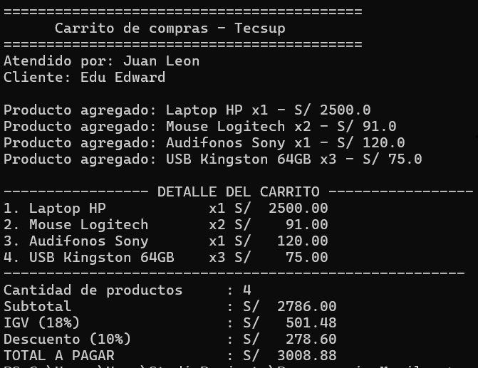

# Laboratorio 02: Carrito de Compras en Kotlin

**Estudiante:** Edu Edward  
**Curso:** Programación en Móviles (4to Ciclo)  
**Docente:** Juan José León Suiyon  
**Institución:** Tecsup

---

## Descripción del Proyecto

Este proyecto implementa la lógica de un carrito de compras por consola en Kotlin para el Laboratorio N° 02. Permite gestionar productos con sus cantidades, calcular subtotal, IGV (18%) y aplicar descuentos dinámicos usando `when`, además de generar un reporte ordenado en columnas.

### Funciones Implementadas:
* `calcularSubtotal`: Suma los importes (precio × cantidad) del carrito.
* `calcularIGV`: Calcula el 18% del subtotal.
* `calcularTotal`: Suma el subtotal más el IGV.
* `calcularDescuento`: Evalúa mediante `when` si aplica un 5% (compras mayores a S/ 3000) o un 10% (compras mayores a S/ 5000).
* `mostrarDetalle`: Muestra el detalle de la compra alineado en columnas usando `String.format`.
* `buscarProducto`: Busca un producto por nombre utilizando `.find`.

---

## Pregunta de Reflexión

> **¿Por qué `nombre` y `precio` son `val` pero `cantidad` es `var` en la `data class Producto`? ¿Qué pasaría si intentas cambiar el precio después de crear el producto?**

* **Respuesta:**  
  `nombre` y `precio` son `val` (inmutables) para evitar que los datos del producto cambien por error durante la compra. `cantidad` es `var` (mutable) porque el cliente puede modificar la cantidad de elementos a llevar. Si intentas cambiar el precio (`producto.precio = 50.0`), Kotlin genera un error de compilación indicando que una propiedad `val` no puede ser reasignada.

---

## Resultado en Consola

