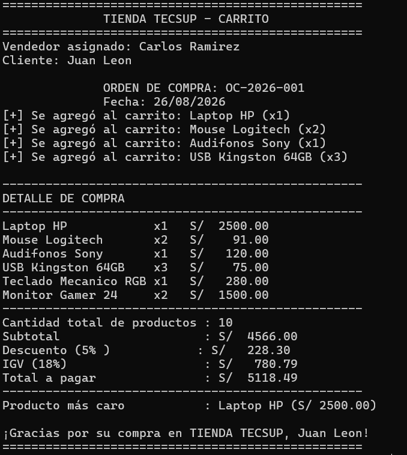

## Prompt utilizado para la generación del código

```text
Crea un programa ejecutable en Kotlin para consola que simule la lógica de un carrito de 
compras para "TIENDA TECSUP" modelando los datos con una `data class Producto(val nombre:
 String, val precio: Double, var cantidad: Int)` y almacenándolos en una `MutableList<Producto>`
  a nombre del cliente "Juan Leon"; implementa de forma independiente las funciones 
  `calcularSubtotal`, `calcularIGV` (18%), `calcularTotal` y `calcularDescuento` 
  (usando una estructura `when` para aplicar 10% si supera S/ 5000, 5% si supera S/ 3000, y 0% en otro caso), 
  además de obtener el producto más caro con `maxByOrNull` e imprimir el detalle con columnas alineadas mediante
   `String.format` ("%-20s", "x%d", "S/ %8.2f"); finalmente, agrega los productos Laptop HP (S/ 2500, x1), 
   Mouse Logitech (S/ 45.5, x2), Audifonos Sony (S/ 120, x1) y USB Kingston 64GB 
   (S/ 25, x3) para reproducir exactamente la salida en consola donde se muestren los mensajes de confirmación 
   al agregar, la lista detallada, la cantidad total de productos, los montos calculados con 2 decimales, el 
   producto más caro, la línea de descuento aplicado y el saludo final.

