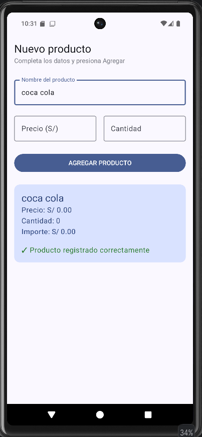
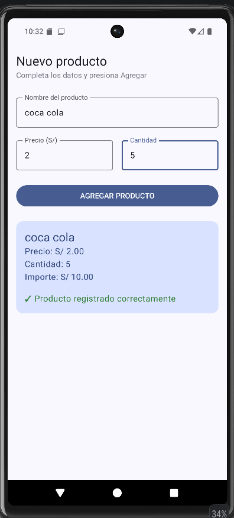

# Laboratorio 03 - Registro de Producto

## Estudiante

Edward Edu Galindo Huamán

## Descripción

Aplicación Android desarrollada con Kotlin y Jetpack Compose para
registrar productos mediante una interfaz gráfica.

La aplicación permite ingresar:

- Nombre del producto
- Precio del producto
- Cantidad

Al presionar el botón **AGREGAR PRODUCTO**, se muestra un resumen
del producto registrado y se calcula automáticamente el importe
multiplicando el precio por la cantidad.

## Tecnologías utilizadas

- Kotlin
- Android Studio
- Jetpack Compose
- Material 3

## Funcionalidades

La aplicación cuenta con:

1. Encabezado con el título "Nuevo producto".
2. Texto descriptivo.
3. Campo para ingresar el nombre del producto.
4. Campo para ingresar el precio.
5. Campo para ingresar la cantidad.
6. Botón "AGREGAR PRODUCTO".
7. Tarjeta de resumen del producto.
8. Cálculo automático del importe.
9. Mensaje de confirmación del registro.

## Capturas de pantalla

### 1. Pantalla inicial

La aplicación muestra el formulario para ingresar los datos del
producto.

> 

### 2. Producto registrado

Después de ingresar los datos y presionar el botón
**AGREGAR PRODUCTO**, se muestra la información del producto,
incluyendo el precio, cantidad e importe calculado.

> 

## Cálculo del importe

El importe se obtiene multiplicando el precio del producto por
la cantidad ingresada.

**Fórmula:**

```text
Importe = Precio × Cantidad