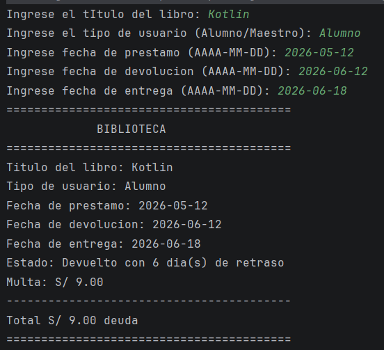

# Sistema de Prestamo de Biblioteca
Galindo Huaman Edu Edward
## Descripcion

Proyecto desarrollado en Kotlin para gestionar el prestamo y devolucion de libros.

El programa permite ingresar los datos de un prestamo y calcular automaticamente los dias de retraso y la deuda correspondiente.

## Tipos de usuario

- Alumno: S/ 1.50 por cada dia de retraso.
- Maestro: S/ 3.00 por cada dia de retraso.

## Datos solicitados

- Titulo del libro
- Tipo de usuario
- Fecha de prestamo
- Fecha de devolucion
- Fecha de entrega

## Formato de fecha

Las fechas deben ingresarse en el formato:

AAAA-MM-DD

Ejemplo:

2026-08-28

## Funcionamiento

El programa compara la fecha de entrega con la fecha de devolucion.

Si el libro se entrega despues de la fecha de devolucion, se calculan los dias de retraso.

La multa se calcula de la siguiente manera:

Alumno = dias de retraso x S/ 1.50

Maestro = dias de retraso x S/ 3.00

## Tecnologias utilizadas

- Kotlin
- LocalDate
- ChronoUnit
- readln()

## Ejemplo

 

## Objetivo

Aplicar conceptos basicos de programacion en Kotlin, como variables, funciones, data class, if, when,
entrada de datoss y manejos de fechas.

