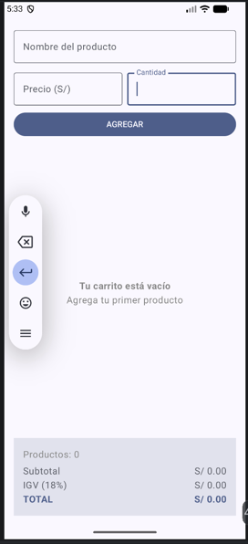
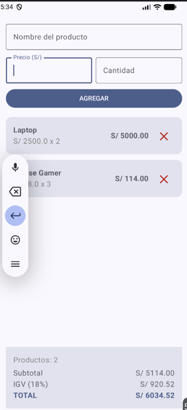

# Laboratorio 04: Carrito de Compras en Jetpack Compose

Aplicación móvil desarrollada en Android Studio con Jetpack Compose que implementa un carrito de compras reactivo con validación de datos, cálculo de totales (Subtotal, IGV y Total) y gestión de estado.

---

## 📱 Capturas de Pantalla

| Estado Vacío | Lista con Productos |
|:------------:|:-----------------:|
|              |                   |

---

## Preguntas Conceptuales

### 1. ¿Por qué `mutableStateListOf` permite reactividad en Compose y una lista estándar (`List` o `ArrayList`) no?
`mutableStateListOf` es una colección especial observable diseñada por el Jetpack Compose Runtime. Cuando se agregan, eliminan o modifican elementos dentro de ella, Compose detecta automáticamente el cambio de estado y desencadena una **recomposición** de las vistas asociadas (como `LazyColumn` o los paneles de totales). Una lista estándar como `List` o `ArrayList` no notifica sus mutaciones al sistema de rastreo de Compose, por lo que la interfaz gráfica no se actualizaría automáticamente al cambiar los datos.

### 2. ¿Qué ocurre si no se usa `remember` al declarar una variable de estado en un Composable?
Si no se utiliza `remember`, la variable se reinicializará a su valor por defecto cada vez que el composable se recomponga (se vuelva a ejecutar). `remember` actúa como un mecanismo de persistencia dentro del ciclo de vida del composable, conservando el valor del estado a través de las diferentes recomposiciones generadas por la interacción del usuario.

### 3. Explica la diferencia entre `Column`, `Row` y `Box` en Jetpack Compose.
* **`Column`:** Organiza a sus elementos hijos de manera secuencial y vertical (uno debajo de otro).
* **`Row`:** Organiza a sus elementos hijos de manera secuencial y horizontal (uno al lado de otro).
* **`Box`:** Superpone sus elementos hijos unos sobre otros (en capas sobre el eje Z). Es ideal para alinear elementos centrados (como estados vacíos) o colocar insignias/botones flotantes.

### 4. ¿Por qué es importante delegar eventos como `onEliminar` a través de lambdas en lugar de manipular la lista dentro del hijo?
Esta práctica sigue el principio de **Unidirectional Data Flow (UDF)** o flujo de datos unidireccional y la elevación de estado (*State Hoisting*). Al delegar los eventos mediante lambdas:
1. El componente hijo (`TarjetaProducto`) se mantiene **sin estado** (*stateless*), haciéndolo reutilizable, predecible y fácil de probar en vistas previas (`@Preview`).
2. El componente padre (`PantallaCarrito`) conserva el control total y la responsabilidad sobre los datos mutables de la aplicación.